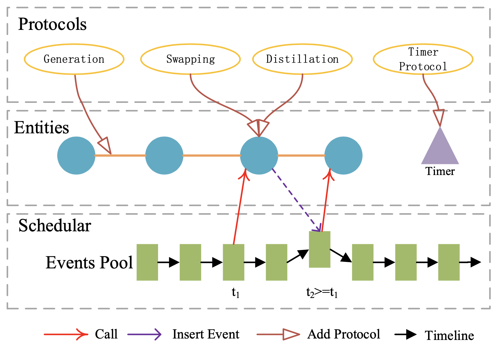

Basic Concepts and Simulation Model
=======================================

Basic Concepts
--------------------------------------

Some basic concepts in ``QuantNetSim`` includes:

Simulator  (:class:`qns.schedular.simulator.Simulator`)
    ``Simulator`` is an event scheduar and the simulator for quantum network and 
    it manages ``Event``  and calls these ``Event`` in sequence based on the time of occurrence.
    ``Simulator`` provides ``add_event`` and ``remove_event`` to insert or remove ``Event``.

Event (:class:`qns.schedular.event.Event`)
    ``Event`` is a set of actions that happens in time ``t``.
    ``Event`` is called by ``Simulator`` and its ``run`` method must be implemented.

Entity  (:class:`qns.schedular.entity.Entity`)
    ``Entity`` is a subject in Simulation.
    It can be a network entity such as a node, link or a controller.
    It can also be a component such as quantum registers or virtual entity such as a ``timer``.
    In ``QuantNetSim``, we make no assumptions about the capabilities of an ``Entity``,
    its capabilities is injected from a ``Protocol``.

Protocol  (:class:`qns.schedular.protocol.Protocol`)
    A protocol adds new capabilities to ``Entity``.
    For example, ``SwappingProtocol`` add entanglement swapping ability to quantum nodes
    while ``ClassicSenderProtocol`` add classic message sending ability to it.

time
    ``time`` is the external time stamp in second. It is an ``Float`` variable.

time_slice
    ``time_slice`` is the inner time stamp in simulator. It is an ``Integer`` variable.
    It is different from ``time`` because the simulation accuracy is flexible.

.. note:: For example, time ``1`` second is ``1000000`` in ``time_slice`` if ``time_accuracy`` is ``1000000``.

The Discrete Time Schedular
--------------------------------------

A discrete time schedular is in ``qns.schedular.simulator``. It has the following main interface:

:meth:`qns.schedular.simulator.Simulator.run`
    The functions will start the simulation

:meth:`qns.schedular.simulator.Simulator.add_event`
    Add an event into the event pool and calls it at time ``start_time``.

:meth:`qns.schedular.simulator.Simulator.remove_event`
    Remove an event from event pool

:meth:`qns.schedular.simulator.Simulator.to_time`
    Convert ``time_slice`` to ``time``

:meth:`qns.schedular.simulator.Simulator.to_time_slice`
    Convert a ``time`` to ``time_slice``

For more informatin, please refer to :class:`qns.schedular.simulator.Simulator`.

Entity and Protocol
--------------------------------------

``Entity`` is a entity in simulation. It has the following API:

:meth:`qns.schedular.entity.Entity.install`
    Initialize parameters and insert initial events.
    If it is not overrided, it will call its all protocols' ``install`` function.

:meth:`qns.schedular.entity.Entity.handle`
    Handle event function.
    If it is not overrided, it will call its all protocols' ``handle`` function.

:meth:`qns.schedular.entity.Entity.inject_protocol`
    This method is used to inject one or more protocols into this entity.

For more informatin, please refer to :class:`qns.schedular.entity.Entity`.

``Protocol`` implements a special ability for an ``Entity``.

:meth:`qns.schedular.protocol.Protocol.install`
    Initialize parameters and insert initial events.
    This method should be overrided.

:meth:`qns.schedular.protocol.Protocol.handle`
    Handle event function. This function is called when a event is sent to this entity.
    This method should be overrided.

For more informatin, please refer to :class:`qns.schedular.protocol.Protocol`.

.. note::
    In ``Protocol``, we usually use ``self`` to refer the ``Entity`` it injects, 
    while we use ``_self`` to refer the ``Protocol`` itself.

Event and Message Model
--------------------------------------

An ``Event`` is added to the simulator with a ``start_time_slice``.
Its :meth:`qns.schedular.event.Event.run` will be called at ``start_time_slice``.
For more informatin, please refer to :class:`qns.schedular.event.Event`.

We devide the messaging model into ``Active Mode`` and ``Passive Mode``.

In ``Active Mode``, ``Entity`` or ``Protocol`` will insert several initial ``Event`` in simulator
so that those events can call ``Entity`` or ``Protocol``'s certain function periodly or one-time.

While in ``Passive Mode``, the event is generated by other ``Entity`` and  the execution of a specific function of this ``Entity``.

1. Active Mode
^^^^^^^^^^^^^^^^

In ``Active Mode``, an ``Entity`` or its ``Protocol`` can generate one or more events in ``install`` function 
and then insert them into simulator.
The event will call arbitrary function of the ``Entity`` itself.

``Active Mode`` is usually used when the ``Entity`` will periodly perform some actions.

.. note::
    However, it will bring a heavy overhead in simulation initialization because it will insert too many events in the simulator.
    To address this issue, it is better to call a ``ArrangeEvent`` to insert Handle Event for the following ``step`` time.
    For the ``ArrangeEvent`` is called with a lower frequence, the overhead will be decreased.
    An example is in :class:`qns.timer.timer.Timer`.

2. Passive Mode
^^^^^^^^^^^^^^^^^

The ``Passive Mode`` has two forms. The first form is just like ``Active Mode`` 
while the second form provides a simple way to call other ``Entity``.

The first form is just like ``Active Mode``.
A new ``Event`` must be implemented.
In that ``Event``, the arbitrary method of other ``Entity`` can be called with arbitrary parameters.

.. note::
    An example of this form is :class:`qns.entangled.events.GenerationEvent`

The second form is much more easiler to implement but has strict limitations.
One ``Entity`` can call another ``Entity``'s :meth:`qns.schedular.entity.Entity.call` method.
In ``call`` method,  a common :class:`qns.schedular.entity.CallEvent` is used instead a self-defined event.
The ``CallEvent`` will call the ``Entity``'s :meth:`qns.schedular.entity.Entity.handle` method at time ``time_slice``.
If ``time_slice`` is ``None``, the CallEvent happens currently.
The parameters of ``call`` function and ``handle`` method has an strict form:

* simulator: the simulator
* msg: anything, e.g. classic message, photon etc.
* source: the caller
* event: any event that calls this call, could be ``None``. The ``handle`` function can use ``event`` to distinguish call types and dispatch it to different processing functions.

.. note::
    An example of this form is :meth:`qns.bb84.device.PhotonRandomSendProtocol`